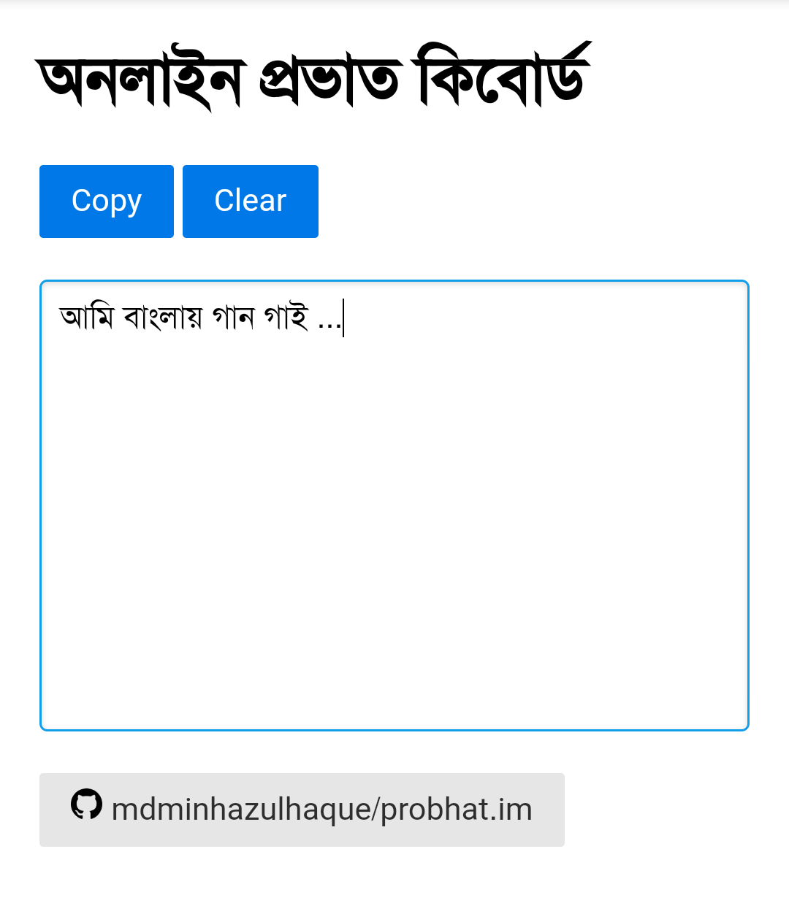

# probhat.im
:globe_with_meridians: Online Probhat Keyboard



## jQuery.IME

jQuery.IME is a jQuery based input method editor library supporting more than 135 input methods across more than 62 languages.

These input methods are well tested. Initially the input methods were contributed by the Wikimedia community. By now many input methods have also been contributed by Red Hat.

This project is a Wikimedia foundation initiative to provide language technology tools to a wider audience outside the Wikimedia universe.

This input tool is widely deployed in all Wikimedia projects (eg: wikipedia).

https://github.com/wikimedia/jquery.ime

## TODO

- [x] Support mobile browser
- [x] Remove bootstrap.css
- [ ] Add FAQ pages
- [ ] Multiple notepad
- [ ] Save text to local storage
- [ ] Warn user when hitting Ctrl+W

## nginx

```
server {
        listen 80;
        server_name probhat.im www.probhat.im;

        root /www/probhat;
        index index.html;

        location / {
            try_files $uri $uri/ /index.html;                
        }
        
        location /app.cache {
            add_header Content-Type "text/cache-manifest";
        }
        
        location ~ /\.git {
            deny all;
        }
}
```
